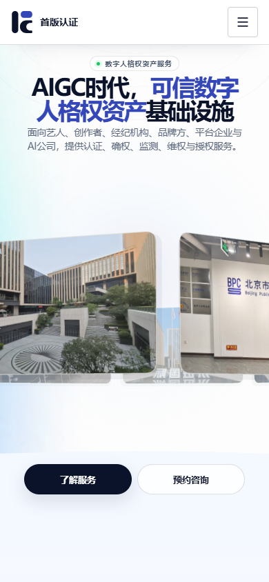
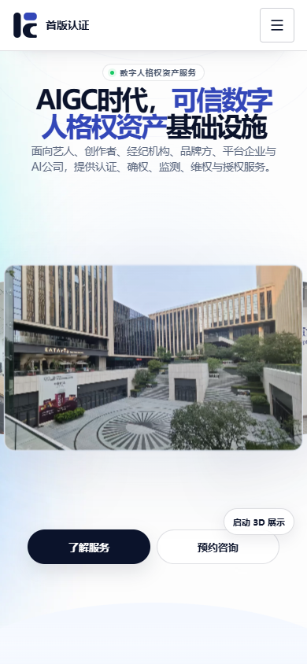
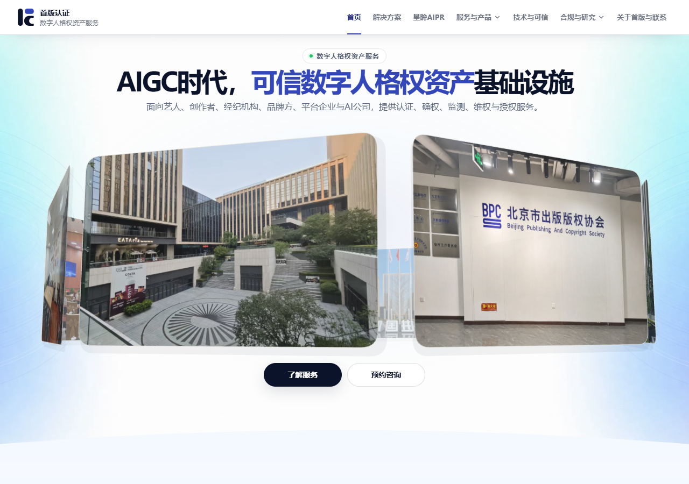
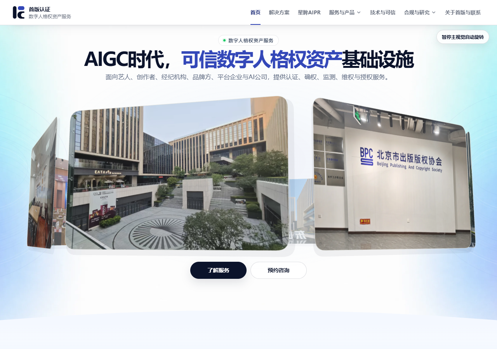

# 首页移动端性能与视觉验收证据

## 测试条件

- 视口：移动端 390 × 844；桌面截图 1280 × 900
- Lighthouse：13.5.0；Headless Chrome：154；移动 UA：Moto G Power（2022）模拟
- Lighthouse 节流：模拟移动网络，150 ms RTT、1638.4 Kbps、4× CPU
- 前后各 3 次独立运行；表格为中位数（最小值–最大值）
- 移动端前后截图均在页面顶部，首屏截图；桌面为首页 1280px 视口截图

性能数据来自 Lighthouse 报告摘要；原始 JSON、trace 和 DevTools 日志留在本地临时目录，没有提交到仓库。此组“优化后”数据和截图采集于首轮性能优化提交 `b7eee9454bbf8f75e497426caf7b7799bcf32646`。本 PR 后续补丁只改变 `prefers-reduced-motion` 在运行时切换时的媒体行为；在默认 `reduce=false` 时，首屏渲染路径与媒体内容不变。以下数据不代表该后续补丁再次运行了 Lighthouse。

## Lighthouse 移动端结果

| 指标 | 优化前中位数（范围） | 优化后中位数（范围） |
| --- | ---: | ---: |
| Performance | 55（53–56） | 84（83–84） |
| 模拟 LCP | 12,788 ms（12,759–12,831） | 4,588 ms（4,588–4,606） |
| TBT | 786 ms（735–893） | 51 ms（47–66） |
| FCP | 1,057 ms（1,056–1,196） | 1,059 ms（1,059–1,071） |
| CLS | 0 | 0 |
| Accessibility | 97 | 100 |
| Best Practices | 100 | 100 |
| SEO | 100 | 100 |

首屏主视觉图片仍是 LCP 候选。Chrome trace 中观察到的实际 LCP 候选约为 347–410 ms，但 Lighthouse 的模拟 LCP 仍约 4.59 秒，超过 4 秒阶段目标约 0.59 秒；两者采用的观测与模拟口径不同，不能互相替代。结果如实保留，没有调整 Lighthouse 配置。

## 视觉与交互差异

- 移动端优化前由 3D 轮播自动旋转；优化后默认显示同一组公司原始素材中的静态首屏图片，并提供“启动 3D 展示”按钮。用户启动后进入原有 3D 图片场景，自动旋转控件变为暂停／恢复；移动端不再于首屏加载时自动启动 WebGL。
- 桌面端继续自动旋转并支持拖拽；新增可键盘访问的暂停／恢复控件。首屏公司图片、标题、说明和业务入口保持。
- 未替换、生成或压缩公司的图片/视频素材；未修改业务内容或生产配置。

## 截图

### 移动端，390 × 844

| 优化前 | 优化后（静态首屏） |
| --- | --- |
|  |  |

### 桌面端，1280px

| 优化前 | 优化后 |
| --- | --- |
|  |  |
